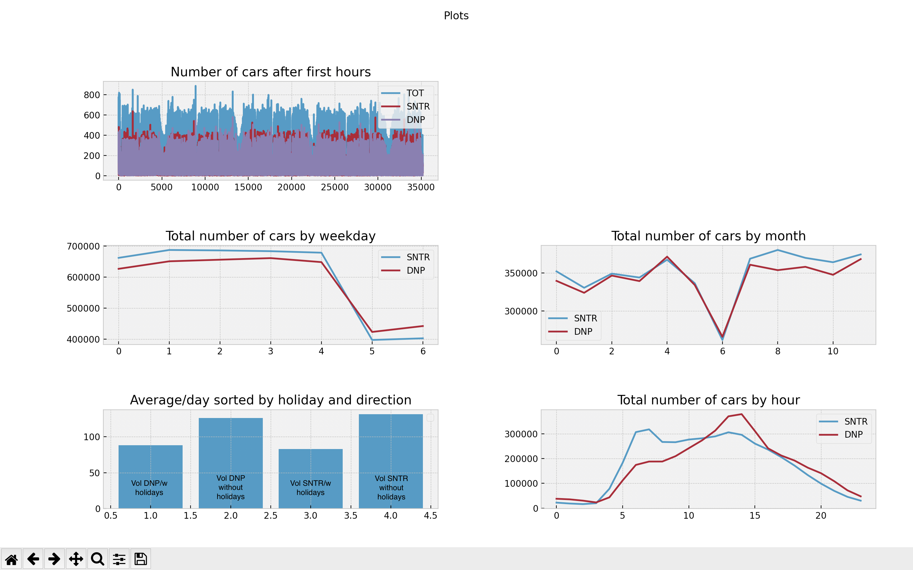
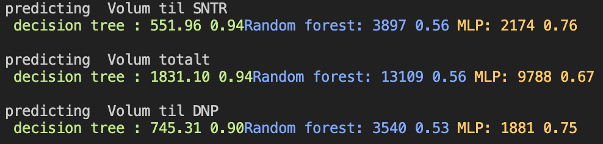
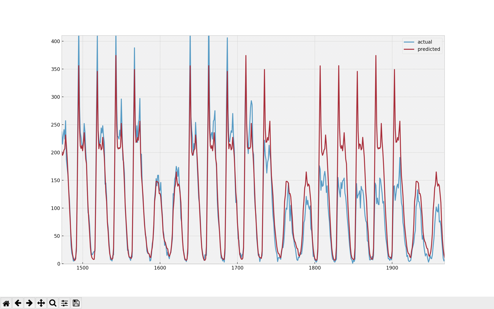

# Project 2
On this project Tobias Sletvold Eilertsen(tei024) and Ingrid Liabakk Eriksen(ier008) worked together. We split the work 50/50.

### Design choices:
Folder structure: 

    Input data: /data/

    Python files: /src/

    Main file: /src/main.py

One class for each model, and one class for preprocessing the data and one class for visualization of the data. 
One data file for already processed data to save time. 

The main method fits all tree models for each direction. Performance is measured with MSE and R**2.

# Task 1.2 Preprocessing

## Extracted several features from the given data:
Months, mainly to represent seasons
Weekdays, represented by 0-6
is holiday, boolean/categorical value. Added manually spring, easter etc and added norwegian holidays from a libary.
'Fra time' is unchanged.
All other features are removed.

## Plotted features to find patterns
to plot, uncomment plot_features() in main method.

Observations from plots:
There are big variations depending on the features we selected, such as weekdays 5-6 and july having lower traffic

# Task 1.3
## Modelling
Trained and tested three models:
1. Decision Tree Regressor
2. Linear Regression
3. MLP Regressor

Best model was Decision Tree Regressor with a R2 score of between 0.91 and 0.94 and the lowest MSE for the different predictions. 

We already know form plotting that the models are going to differ some, e.g. different traffic at different hours. Tried learning a model with y as 'Sentrum' using it to predict 'Danmarksplass' and got a R2 score as 0.62, proving the models differ too much to be used interchangably.

We visualized the data to plot actual and predicted values, and found that the model appears to sometimes guess way higher, maybe because of some holiday the model is unaware of. The model also does not predict less than 6, but even though the actual data is so. The model rarely predicts higher than 380 cars/hour even though the value is higher than 400 cars/hour.

### Predicting 2020

We tried using all data as training data, and then predicting the data for 2020. 
In this plot we can see that the prediction is true, but suddently drops when the covid-19 restrictions started.

If we had deployed the system in the beginning of 2020 we would expect to have a R2 score of higher than 0.9, but we got 0.84. We have learned that there is some factors that we can't predict. 

# Task 1.4
We have one additional feature that is Norwegain holidays that helps us get a more accurate prediction. We found the dates for the holidays online, which increase the R2 score with 3% on average. 